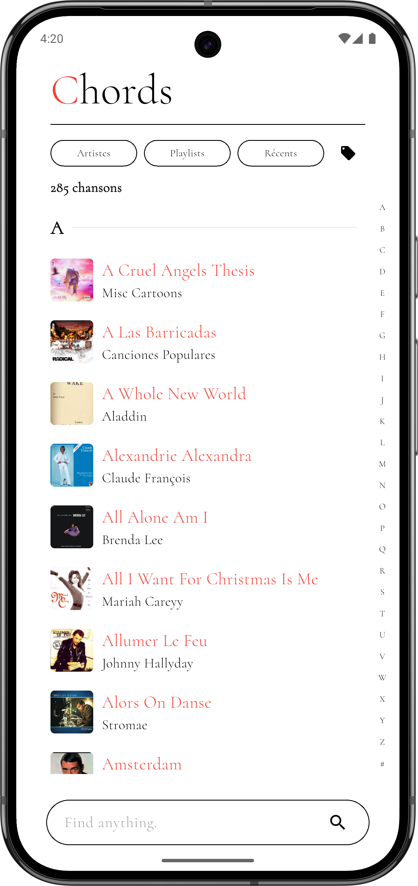

# Chords


A clean, offline-first, and API-agnostic manager for guitar tabs and sheet music. 

**Chords** is designed as a pure client. It does not ship with any copyrighted material, tabs, or lyrics. Instead, it provides a flexible mapping engine allowing users to connect their own REST APIs or self-hosted databases to search, download, and manage their music library locally.

<p align="center">
  
</p>

## Features

* **🌐 Multi-Language:** Available in English and French.
* **🔌 Bring Your Own Data (BYOD):** Connect to any JSON REST API. Use the in-app UI or scan a QR code to map search endpoints, details paths, and JSON keys to the app's internal data model.
* **📴 Offline-First:** Powered by Isar Database. Once a song is added to your library, it is available entirely offline.
* **🎸 Smart Reader:**
  * Auto-scrolling with adjustable speed.
  * Real-time chord transposition.
  * Chord simplification (e.g., turns `Cmaj7sus4` into `C`).
* **🛠️ Built-in Musician Tools:**
  * **Tuner:** Microphone-based pitch detection.
  * **Metronome:** Low-latency visual and audio metronome.
* **📁 Setlists & Export:** Group songs into playlists and export your library as a customized PDF Songbook.

## Getting Started

### Prerequisites

* Flutter SDK (>= 3.2.0)
* Dart SDK

### Installation

1. **Clone the repository:**
   ```bash
   git clone https://github.com/phi-k/chords.git
   cd chords
   ```

2. **Install dependencies:**
   ```bash
   flutter pub get
   ```

3. **Generate Isar schemas and Localization files:**
   ```bash
   dart run build_runner build --delete-conflicting-outputs
   flutter gen-l10n
   ```

4. **Run the app:**
   ```bash
   flutter run
   ```

## Connecting a Data Source & API Keys

Out of the box, the app will display an empty state.

* **Data Sources:** To fetch tabs, navigate to **Settings > Data Sources** and add a new source. You can configure Base URLs, Headers, Endpoints, and JSON Mapping.

* **API Keys (Optional):** The app uses external APIs for specific metadata (like fetching album covers via Genius or fallback search suggestions via Google Gemini). Navigate to **Settings** to input your own API keys securely on your device.

## License

This project is free and open-source. It is distributed without any warranty.
Please refer to the `LegalPage` within the application for terms of use regarding modifications, distribution, and attribution.

---
*Developed by phi-k.*